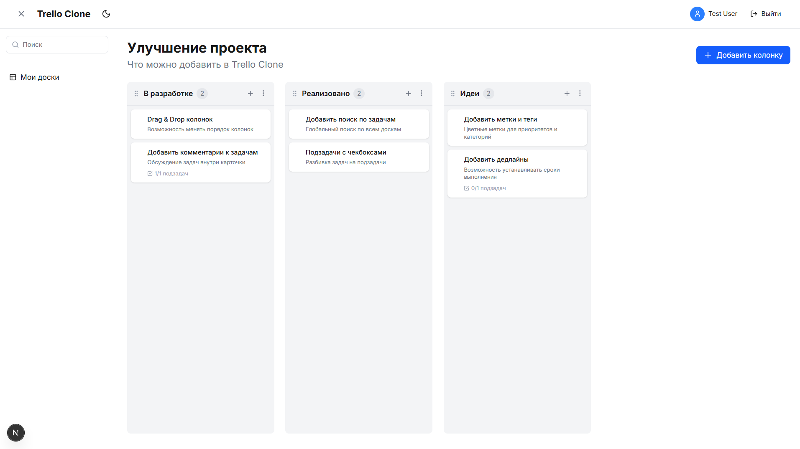

# 📋 Trello Clone — Modern Project Management



<div align="center">

[](https://nextjs.org/)
[](https://reactjs.org/)
[](https://tailwindcss.com/)
[](https://www.prisma.io/)
[](https://next-auth.js.org/)
[](https://www.docker.com/)

---

**Trello Clone** — это современное приложение для управления проектами, сочетающее мощный функционал Drag & Drop и элегантный интерфейс. Построено на передовом стеке (Next.js 16, React 19) с полной поддержкой темной темы и мобильных устройств.

[Возможности](#✨-возможности) • [Установка](#🚀-быстрый-старт) • [Стек](#🛠-технологический-стек) • [Docker](#🐳-запуск-через-docker) • [Тесты](#📋-тестовые-данные)

</div>

---

## 📋 Тестовые данные

Для быстрого ознакомления используйте следующие реквизиты:
- **Email:** `user@example.com`
- **Password:** `password123`

---

## ✨ Возможности

- 🔐 **Аутентификация (NextAuth v5)**: Полноценная регистрация и вход в систему с защищенными сессиями.
- 🎯 **Интуитивный Drag & Drop**: Плавное перетаскивание задач между колонками и изменение порядка самих колонок с помощью `@dnd-kit`.
- 📊 **Управление Досками**: Создание персональных досок с настраиваемыми названиями и описаниями.
- 📝 **Гибкие Задачи и Подзадачи**: Возможность декомпозировать задачи на мелкие пункты (checklist) для детального контроля.
- 🔍 **Умный Поиск**: Мгновенный поиск по всем задачам и подзадачам на текущей доске.
- 🌓 **Премиальная Темная Тема**: Автоматическая адаптация под систему и ручное переключение.
- 📱 **Ultra Responsive Design**: Комфортная работа на смартфонах, планшетах и десктопах.
- 🐳 **Docker-Ready**: Полная контейнеризация для мгновенного развертывания в любой среде.

---

## 🛠 Технологический стек

### Frontend
- **Framework**: [Next.js 16 (App Router)](https://nextjs.org/)
- **Library**: [React 19](https://react.dev/)
- **Styling**: [Tailwind CSS](https://tailwindcss.com/)
- **Icons**: [Lucide React](https://lucide.dev/)
- **Drag & Drop**: [@dnd-kit](https://dndkit.com/)
- **State/Caching**: [TanStack Query v5](https://tanstack.com/query)

### Backend & Database
- **ORM**: [Prisma 6](https://www.prisma.io/)
- **Auth**: [NextAuth.js v5](https://next-auth.js.org/) (Beta)
- **Database**: PostgreSQL
- **Security**: [bcryptjs](https://github.com/dcodeIO/bcrypt.js)

---

## 🚀 Быстрый старт

### 1. Клонирование репозитория
```bash
git clone https://github.com/yanakhmetov/trello-clone.git
cd trello-clone
```

### 2. Установка зависимостей
```bash
npm install
```

### 3. Настройка окружения
Создайте файл `.env.local` на основе примера:
```bash
cp .env.example .env.local
```
Обязательно укажите `DATABASE_URL` и секретные ключи для Auth.

### 4. Инициализация базы данных
```bash
# Применение схемы
npx prisma db push

# (Опционально) Наполнение тестовыми данными
npm run db:seed
```

### 5. Запуск
```bash
npm run dev
```
Откройте [http://localhost:3000](http://localhost:3000).

---

## 🐳 Запуск через Docker

Проект оптимизирован для работы в Docker с удобными скриптами автоматизации (PowerShell):

```powershell
# Полная пересборка и запуск
.\docker-rebuild.ps1  

# Ообычный запуск
.\docker-start.ps1  

# Остановка сервисов
.\docker-stop.ps1    

# Просмотр логов
.\docker-logs.ps1  
```

**Доступные сервисы:**
- **App**: `http://localhost:3000`
- **PostgreSQL**: `:5432`
- **Prisma Studio**: `docker exec -it trello-app npx prisma studio` (доступ по `localhost:5555`)

---

## 📂 Структура проекта

```text
trello-clone/
├── prisma/             # Схемы Prisma и сид-скрипты
├── public/             # Статические файлы и иконки
├── src/
│   ├── app/            # Маршрутизация (App Router) и API
│   ├── components/     # UI-компоненты (Dnd, Boards, Layouts)
│   ├── hooks/          # Кастомные React-хуки
│   ├── lib/            # Утилиты и конфигурации (Auth, Prisma)
│   ├── types/          # TypeScript-интерфейсы
│   └── stores/         # Управление состоянием
├── Dockerfile          # Сборка образа приложения
└── docker-compose.yml  # Оркестрация контейнеров (Dev/DB)
```

---

## 📄 Лицензия

Этот проект распространяется под лицензией MIT. Использование в учебных и коммерческих целях приветствуется.

---
<div align="center">
⭐ Если проект оказался полезным, не забудьте поставить звезду!
</div>